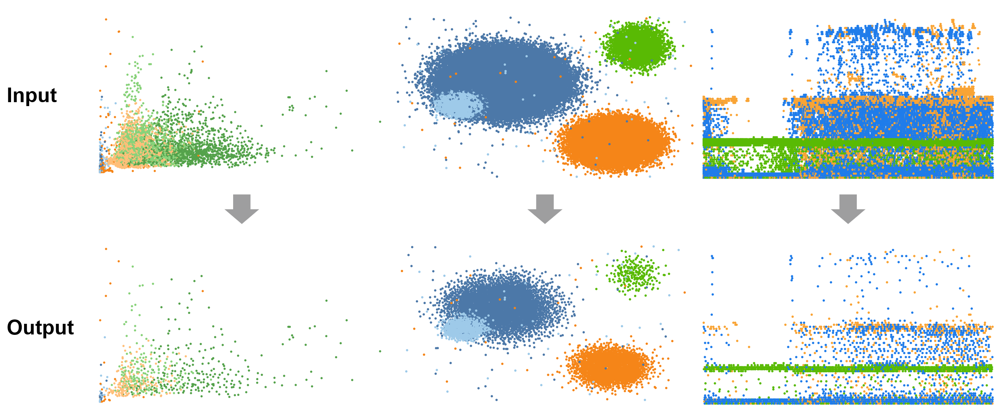

# A Recursive Subdivision Technique for Sampling Multi-class Scatterplots

An interactive demo application for the algorithm proposed in our IEEE VIS 2019 technical paper.
More details of our project can be found [here](http://www.yunhaiwang.net/infoVis2019/scatterplot/index.html).

The program also provides some interactive functions:
1. select interested classes in the bottom left panel;
2. drag and select a local area, then you can select new grid size for this area;
3. the information of the local area you selected will be shown in the right panel.


### Results



### Disclaimer
This is a reimplemented demo with focus on interactivity, and not the code that was used to generate the images and timings in the paper.

### Abstract
We present a non-uniform recursive sampling technique for multi-class scatterplots, with the specific goal of faithfully presenting relative data and class densities, while preserving major outliers in the plots. Our technique is based on a customized binary kd-tree, in which leaf nodes are created by recursively subdividing the underlying multi-class density map. By backtracking, we merge leaf nodes until they encompass points of all classes for our subsequently applied outlier-aware multi-class sampling strategy. A quantitative evaluation shows that our approach can better preserve outliers and at the same time relative densities in multi-class scatterplots compared to the previous approaches, several case studies demonstrate the effectiveness of our approach in exploring complex and real world data.

### Citation
```
@ARTICLE{sampling2019,
author={Xin Chen, Tong Ge, Jian Zhang, Baoquan Chen, Chi-Wing Fu, Oliver Deussen and Yunhai Wang},
journal={IEEE Transactions on Visualization and Computer Graphics},
title={A Recursive Subdivision Technique for Sampling Multi-class Scatterplots},
year={2019},
keywords={Visualization;Data visualization;Measurement;Sampling methods;Estimation;Clutter;Image color analysis;Scatterplot;multi-class sampling;kd-tree;outlier;relative density},
doi={10.1109/TVCG.2019.2934541}
}
```

### Dependencies
The following libraries are required:
* Qt5Core
* Qt5GUI
* Qt5Widgets
* Qt5Svg
* Qt5PrintSupport

### Building
```
TODO
```
